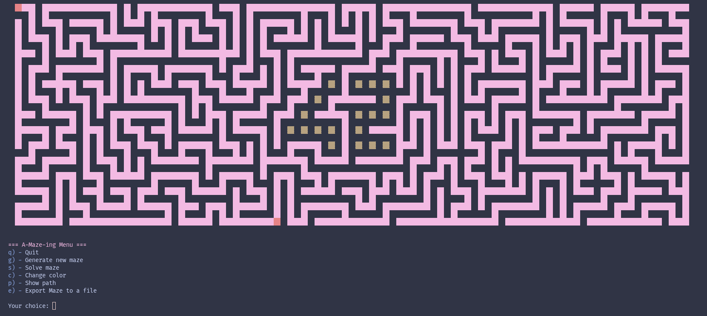
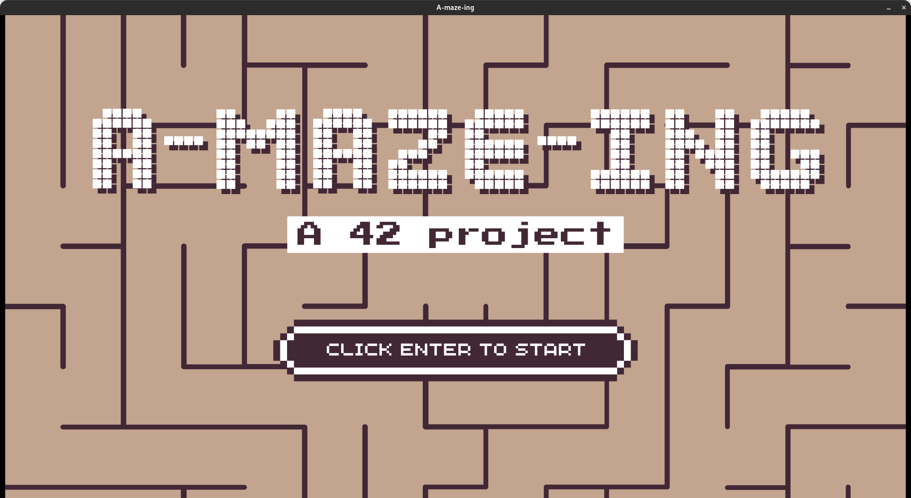

> *This project has been created as part of the 42 curriculum by ialrandr, trakotoz.*

# A-Maze-ing

## Description

A-Maze-ing is an interactive maze generator and solver. Given a configuration file, it
builds a maze, animates its construction wall by wall, finds a path from the entry to
the exit, and lets you watch the solution unfold step by step. Every maze embeds the
digits **4** and **2** as permanent, indestructible walls at its center — a signature
of the 42 school network.

Two visualization backends are available: a lightweight **terminal renderer** built on
ANSI escape codes, and a **2.5D graphical renderer** powered by the school's C-based
MLX windowing library.

| Terminal mode                                         | Graphical mode (MLX)                              |
|:-----------------------------------------------------:|:-------------------------------------------------:|
|   |             |

---

## Instructions

### Prerequisites

- Python 3.10 or later
- The MLX library requires a compatible graphics environment (42 school machines)

### Installation

**1. Create a virtual environment (recommended)**
```bash
python3 -m venv .venv
source .venv/bin/activate
```

**2. Install the MLX library** (local wheel, not on PyPI)
```bash
pip install dependencies/mlx-2.2-py3-none-any.whl
```

**3. Install the remaining dependencies**
```bash
pip install -r requirements.txt
```

**4. Build and install the `mazegen` package**
```bash
cd mazegen && make build
pip install mazegen-0.1.0-py3-none-any.whl
cd ..
```

> Alternatively, install in editable mode without building: `pip install -e mazegen/`

### Running

```bash
python a_maze_ing.py <config_file>
```

**Example:**
```bash
python a_maze_ing.py config.txt
```

> **Using the provided makefile**
```bash
    make help       # If help is needed on what all rules do
    make install    # Installation of the project dependencies
    make run        # Run the program using the virtual env python
    make clean      # Remove python artifactes (cache, mypy_cache)
    make debug      # Run the program using python debugger pdb
```

Passing no argument, or more than one, prints a usage message and exits with status 1.

---

## Configuration

All parameters are read from a plain-text file. Lines beginning with `#` are comments.
Each setting is written as `key = value`. Keys are case-insensitive.

### Complete format

```ini
# Maze dimensions (logical cells, not raw grid pixels)
width       = 20        # Integer, range [1, 200]. Must be ≥ 9 (42 pattern constraint)
height      = 15        # Integer, range [1, 200]. Must be ≥ 6 (42 pattern constraint)

# Entry and exit points: col,row in logical cell coordinates
entry       = 0,0
exit        = 19,14

# Output file
output_file = maze.txt  # Path to write the exported maze and solution

# Maze type: perfect/imperfect
perfect     = true      # true  → spanning-tree maze, exactly one solution
                        # false → loops injected randomly, multiple solutions
                        # Accepts: true/false, yes/no, 1/0

# Reproductibility
seed        = none      # Integer seed for repeatable mazes, or "none" for random

# Algorithm
generator   = auto      # backtracking_dfs | prims | wilsons | auto
                        # "auto" defaults to backtracking_dfs
solver      = auto      # a_star | dijkstra | backtracking_bfs | auto
                        # "auto" defaults to backtracking_bfs

# Visualization
visual      = mlx       # mlx  → 2.5D graphical window
                        # term → ANSI terminal renderer

# Introduction
story       = true      # true → display the narrative intro on startup
                        # Accepts: true/false, yes/no, 1/0
```

### Validation rules

The configuration is validated before the program starts. Any failing field resets to
its default and a warning is printed. The full set of constraints:

- `width` ∈ [1, 200] and `width` ≥ 9; `height` ∈ [1, 200] and `height` ≥ 6.
- `entry` ≠ `exit`; both must be within bounds (`col < width`, `row < height`).
- Neither `entry` nor `exit` may overlap a cell occupied by the 42 pattern.
- `generator` and `solver` must name a registered algorithm or be `"auto"`.
- `visual` must be exactly `"mlx"` or `"term"`.
- `seed` must be a valid integer or the string `"none"`.

---

## Features

### Terminal mode (`visual = term`)

The entire maze grid is drawn with ANSI block characters (`██`, `▓▓`, `  `). Generation
and solving are animated by reprinting the grid on each step. An interactive menu is
shown after generation completes.

| Key | Action |
|---|---|
| `g` | Generate a new maze with a fresh random seed |
| `s` | Solve the maze and animate the path step by step |
| `p` | Toggle showing / hiding the solution path |
| `c` | Cycle to the next color palette |
| `e` | Export the maze and solution to the output file |
| `q` | Quit |

### Graphical mode (`visual = mlx`)

The maze is rendered as a 2.5D scene using tile sprites: walls have height, the floor
is drawn separately, and the solution path is overlaid on the floor tiles. A camera can
be panned across mazes larger than the window.

| Key | Action |
|---|---|
| `ENTER` | Advance maze generation one step |
| `SPACE` | Show / hide the overlay menu |
| `G` | Generate a new maze with a new random seed |
| `S` | Reveal the solution path |
| `P` | Toggle showing / hiding the complete solution path |
| `C` | Change wall and floor colors |
| `↑ ↓ ← →` | Pan the camera |
| `E` | Export the maze and solution to the output file |
| `ESC` | Exit |

### Multiple algorithms

**Generators**

| Name                          | `generator =`         | Strategy                                          | Visual character                      |
|-------------------------------|-----------------------|---------------------------------------------------|---------------------------------------|
| Recursive Backtracking DFS    | `backtracking_dfs`    | Iterative DFS with backtracking                   | Long winding corridors, few dead-ends |
| Randomized Prim's             | `prims`               | Frontier expansion from a seed cell               | Short passages, many dead-end         |
| Wilson's                      | `wilsons`             | Loop-erased random walk (uniform spanning tree)   | Statistically unbiased layout         |

**Solvers**

| Name              | `solver =`            | Strategy                              | Optimal?  |
|-------------------|-----------------------|---------------------------------------|-----------|
| A\*               | `a_star`              | Heuristic search (Manhattan distance) | Yes       |
| Dijkstra          | `dijkstra`            | Uniform-cost graph search             | Yes       |
| Backtracking BFS  | `backtracking_bfs`    | BFS with backtracking                 | Yes       |

### The 42 pattern

The digits **4** and **2** are embedded in the center of every maze as protected cells
(grid value `2`). Generators refuse to carve them, solvers treat them as walls, and the
loop injector preserves a clean border around them. In the terminal they render in
yellow; in the graphical mode floor color different.

### Perfect vs. imperfect mazes

Setting `perfect = false` causes the generator to randomly carve additional walls after
the spanning tree is built, introducing loops and multiple valid solution paths. The
probability of each extra carve is 5% per eligible wall.

### Export

Pressing `E` saves the maze to `output_file` in three sections:

```
hex grid — one row per line, one hex char per logical cell

entry_col,entry_row
exit_col,exit_row
direction string — N/E/S/W characters
```

Example: `EESSWWN` means East, East, South, South, West, West, North.
```

B955553915555555393B
A8553D6AA9393D17C6AA
AC53C53AC6C6A92917C2
AD16D3AC15796AAAC556
C3C552A96956D2AAD157
BAD396C6FAFFFAEC3A93
AC3AC17F9457F853AC6A
A96A96FD43FFFC7C4556
AC386FFFFAFD51395553
856A9557FAFFFAC6957A
A93C295154557A95693A
AE856C3E939396A93AC2
C3E953C52AAC452AAA96
BC3C3A93EC6953EAC6C3
C5456C6C5556D456D556

0,0
19,14
SSSSESSESWSESWWSSSESESEENWNEESSENESEEEENEESEENNNESSENNNESESWSES
```

---

## Maze Generation Algorithm

### Chosen algorithm: Recursive Backtracking DFS (`backtracking_dfs`)

This is the default algorithm (`generator = auto`). It works as follows:

1. Start from the entry cell. Mark it visited.
2. Pick a random unvisited neighbour. Carve the wall between them and move there.
3. If no unvisited neighbour exists, backtrack to the previous cell.
4. Repeat until every cell has been visited.

The implementation is iterative (stack-based) rather than recursive, which avoids
Python's recursion limit on large mazes.

### Why we chose it

- **Visual quality** — DFS produces mazes with long, winding corridors and a low
  density of dead-ends, which feel satisfying to explore and solve.
- **Simplicity** — the algorithm is easy to implement correctly and to reason about.
  A stack and a visited set are all the data structures needed.
- **Speed** — it runs in O(n) time and memory for n cells, making it fast even on
  200×200 grids.
- **Step-friendly** — each iteration of the loop is one atomic carve operation, which
  maps directly onto the `generate_step` generator interface required by both
  visualization backends.

Wilson's and Prim's are also available and can be selected from the config file if a
different aesthetic or statistical property is preferred.

---

## Reusable Code

### The `mazegen` package (`mazegen/`)

The maze engine is a **fully standalone Python package** with no dependency on the
rest of the project. It can be installed independently and used in any Python project:

```bash
pip install mazegen-*-py3-none-any.whl
```

Everything needed to generate and solve mazes lives inside it:

```python
from mazegen import MazeGen, MazeConfig
from mazegen.generator.algorithms import BacktrackingDFS
from mazegen.solver.algorithms import AStar

config = MazeConfig(width=20, height=15, entry_point=(0,0),
                    exit_point=(19,14), perfect=True, seed=42)
maze = MazeGen.generate(BacktrackingDFS, config)
path = MazeGen.solve(AStar, maze)
```

**What is reusable:**

- `Maze` — the grid model with hex export, entry/exit tracking, and path carving.
- `MazeConfig` — the configuration dataclass.
- `MazeGen` — the static facade for generation and solving (full and step-by-step).
- `MazeGenerator` / `MazeSolver` — abstract base classes for adding new algorithms.
  Any subclass that sets `algorithm_name` is auto-registered and immediately usable
  via `MazeGen` without touching any other file.
- `GeneratorRegistry` / `SolverRegistry` — the auto-registration registries.

See [`mazegen/README.md`](./mazegen/README.md) for the full API reference.

### The `core/` module

`MazeManager`, `MazeWriter`, and `Pattern42` are self-contained and reusable outside
this project:

- **`MazeManager`** — a thin facade that bridges a config dictionary to `mazegen`.
  Drop it into any project that loads maze settings from a file or database.
- **`MazeWriter`** — serializes any hex-grid maze to a text file with entry, exit, and
  directional path. The format is documented above and can be parsed independently.
- **`Pattern42`** — generates and queries the 42 cell pattern. Could be adapted for
  any project needing a custom fixed pattern embedded in a procedural grid.

### The `cli_render/` module

`Render` in `cli_render/render.py` depends only on `mazegen.Maze` and the standard
library. It can be reused as a drop-in terminal renderer for any project built on the
`mazegen` package.

---

## Team and Project Management

### Roles

> `ialrandr`:
The main artist of the project, responsible for the MLX-based rendering system and the 2.5D visualization of the maze.
- **Contribution**: Contributed significantly to the design of the mazegen API, helping define a clear and flexible contract between users and the module.
- **Main workspace**: `display` module, containing the assets used, the display configuration, conversion of low-level MLX functionality into user-friendly abstractions

> `trakotoz`:
The main architect of the project, responsible for the overall structure, maintainability, and reliability of the system.
- **Contribution**: Contribute in the algorithm implementation and configuration file parsing with the reusable module `mazegen`
- **Main workspace**: `core` + `mazegen`, core for the main configuration of the program, mazegen as the reusable module


### Planning

**Initial plan:**
Develop efficient maze-generation algorithms, provide a user-friendly interface, and maintain a clean and well-structured architecture.

**How it evolved:**
The project's evolution truly began when the reusable Python module was transformed into an extensible framework, allowing users to contribute,
implement their own algorithms, and bring their ideas to life.
On the UI side, the focus shifted toward long-term usability,
particularly for future projects, while also providing a deeper understanding of how game engines actually work.

### What worked well / what could be improved

**What worked well:**
One of the group's greatest strengths was the clear separation of responsibilities.
Each member worked independently on their own module, relying only on well-defined interfaces and mutual trust.
This allowed parallel development without requiring deep knowledge of the internal implementation of other components.
This approach enabled us to deliver a functional first version of the project.
While some design decisions and architectural aspects could still be improved,
the modular structure proved effective throughout development.

**What could be improved:**
The current `mazegen` pipeline relies on an intermediate `2x + 1` representation before converting data into the hexadecimal format,
which introduces unnecessary processing overhead.
A more efficient approach would be to use the hexadecimal representation throughout the entire pipeline.
Although bit-level manipulation is more complex to implement, it offers significant performance and memory benefits.
While the `display` module is functional and can be reused independently, its internal structure would benefit from further refinement.
Some files are excessively long, and certain responsibilities are duplicated across functions, reducing overall maintainability and modularity

### Tools used


| Tool              | Purpose                           |
|-------------------|-----------------------------------|
| Git               | Version control of the project    |
| VScode / Neovim   | Main editor for each member       |
| Slack             | Team way to communicate           |

---

## Resources

### Maze generation

- [Maze generation algorithms — Jamis Buck's blog](https://weblog.jamisbuck.org/2011/2/7/maze-generation-algorithm-recap) — comprehensive overview of DFS, Prim's, Wilson's, and more, with animated examples.
- [Think Labyrinth — Walter D. Pullen](https://www.astrolog.org/labyrnth/algrithm.htm) — encyclopedic reference on maze types, generation, and solving algorithms.
- [Wilson's algorithm — Wikipedia](https://en.wikipedia.org/wiki/Loop-erased_random_walk) — uniform spanning trees and loop-erased random walks.

### Pathfinding / solving

- [A\* search algorithm — Wikipedia](https://en.wikipedia.org/wiki/A*_search_algorithm) — heuristic search with pseudocode.
- [Dijkstra's algorithm — Wikipedia](https://en.wikipedia.org/wiki/Dijkstra%27s_algorithm) — uniform-cost shortest-path search.
- [Red Blob Games — Introduction to A\*](https://www.redblobgames.com/pathfinding/a-star/introduction.html) — interactive visual guide to BFS, Dijkstra, and A\*.

### Python

- [Python `abc` module](https://docs.python.org/3/library/abc.html) — abstract base classes used for `MazeGenerator` and `MazeSolver`.
- [Python generators — PEP 257](https://peps.python.org/pep-0257/) — the generator protocol underlying `generate_step` and `solve_step`.
- [Python `dataclasses` module](https://docs.python.org/3/library/dataclasses.html) — used for `MazeConfig` and `DisplayConfig`.

### Graphical rendering

- [MLX documentation (42 school)](https://harm-smits.github.io/42docs/libs/minilibx) — reference for the MiniLibX/MLX windowing library.
- [NumPy documentation](https://numpy.org/doc/stable/) — array operations used for the pixel buffer in the graphical renderer.

### Use of AI

AI assistance (Claude, Anthropic) was used during this project for the following tasks:


| Task                          | Part of the project                                   |
|-------------------------------|-------------------------------------------------------|
| Algorithm understanding       | graph theory, lesson on heuristic                     |
| Documentation on tool used    | numpy learning, mlx documentation, pyhton docstring   |
| README                        | help on the redaction of README and code documentation|
| Optimization idea             | idea on the `hex` version                             |

AI was not used to generate the project's core algorithms or architecture. All implementations were developed, reviewed, and fully understood by the team.

---

*Built at 42 Antananarivo.*
